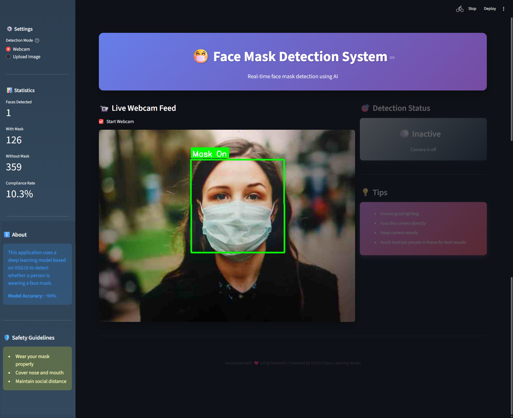
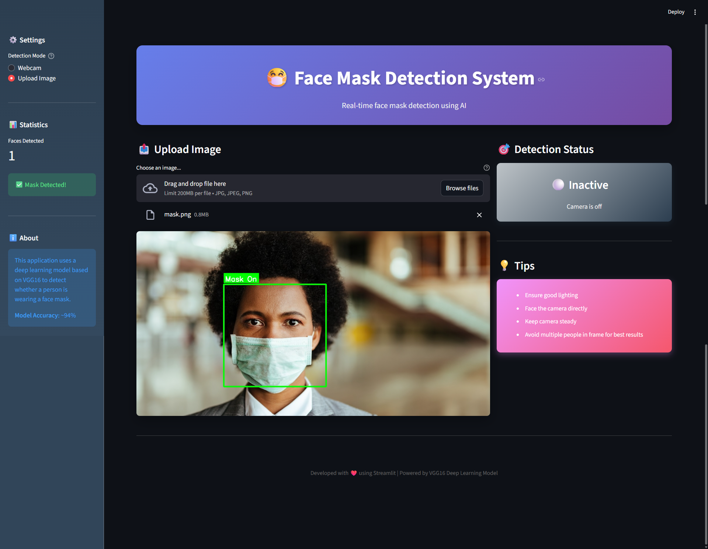

# [Face Mask Detection System](https://face-mask.nishantkhadka.com.np/)

<div>
  
</div>
<div>
  
</div>

## 📋 Table of Contents

- [Overview](#overview)
- [Background &amp; Theory](#background--theory)
- [Features](#features)
- [Architecture](#architecture)
- [Dataset](#dataset)
- [Installation](#installation)
- [Usage](#usage)
- [Model Training](#model-training)
- [Web Application](#web-application)
- [Screenshots](#screenshots)
- [Performance](#performance)
- [Troubleshooting](#troubleshooting)
- [Contributing](#contributing)
- [License](#license)

## 🔍 Overview

This project implements a **real-time face mask detection system** using deep learning and computer vision techniques. The system can identify whether a person is wearing a face mask through both live webcam feed and uploaded images, making it suitable for deployment in public spaces, offices, and healthcare facilities.

**Live Demo:** [https://face-mask.nishantkhadka.com.np](https://face-mask.nishantkhadka.com.np)

**Dataset Source:** [Roboflow COVID-19 Dataset](https://universe.roboflow.com/pyimagesearch/covid-19-pis/dataset/2)

## 🧠 Background & Theory

### Problem Statement

During the COVID-19 pandemic, wearing face masks became a critical public health measure. Manual monitoring of mask compliance in crowded spaces is impractical and labor-intensive. This project addresses this challenge by automating mask detection using artificial intelligence.

### Technical Approach

#### 1. **Transfer Learning with VGG16**

The model leverages **VGG16**, a convolutional neural network pre-trained on ImageNet dataset containing 1.2 million images across 1000 categories. Transfer learning allows us to:

- Utilize learned low-level features (edges, textures, patterns)
- Reduce training time significantly
- Achieve high accuracy with limited dataset
- Overcome overfitting on small datasets

**VGG16 Architecture:**

```
Input (224×224×3)
↓
Block 1: Conv2D(64) → Conv2D(64) → MaxPooling
↓
Block 2: Conv2D(128) → Conv2D(128) → MaxPooling
↓
Block 3: Conv2D(256) × 3 → MaxPooling
↓
Block 4: Conv2D(512) × 3 → MaxPooling
↓
Block 5: Conv2D(512) × 3 → MaxPooling
↓
Flatten
↓
FC(4096) → FC(4096)
↓
Custom: Dense(1, sigmoid) [Our addition]
```

#### 2. **Face Detection with Haar Cascades**

Before mask detection, we use **Haar Cascade Classifier** to detect faces in images:

- Pre-trained classifier for frontal face detection
- Fast and efficient for real-time applications
- Works well under varying lighting conditions
- Returns bounding box coordinates (x, y, width, height)

#### 3. **Binary Classification**

The problem is framed as binary classification:

- **Class 0 (With Mask):** Prediction < 0.5
- **Class 1 (Without Mask):** Prediction ≥ 0.5

**Loss Function:** Binary Cross-Entropy

```
L = -[y·log(ŷ) + (1-y)·log(1-ŷ)]
```

**Optimizer:** Adam (Adaptive Moment Estimation)

- Learning rate adaptation per parameter
- Momentum-based optimization
- Efficient for sparse gradients

### Why This Approach Works

1. **Pre-trained Features:** VGG16 already understands facial features from ImageNet training
2. **Fine-tuning Strategy:** Freezing all layers except the last ensures we only adapt high-level features
3. **Data Augmentation:** Original dataset is augmented with rotations, flips, and transformations

## ✨ Features

- ✅ **Real-time Detection:** Live webcam feed with instant mask detection
- ✅ **Image Upload:** Analyze static images for mask compliance
- ✅ **Face Detection:** Automatic face localization using Haar Cascades
- ✅ **Multi-face Support:** Detect masks on multiple faces simultaneously
- ✅ **Confidence Scores:** Display prediction probabilities
- ✅ **Statistics Dashboard:** Real-time compliance metrics
- ✅ **Modern UI:** Gradient-based responsive design
- ✅ **Color-coded Results:** Green for mask, red for no mask
- ✅ **Bounding Boxes:** Visual indicators on detected faces

## 🏗️ Architecture

### System Architecture

```
┌─────────────────┐
│   Input Source  │
│ (Webcam/Image)  │
└────────┬────────┘
         │
         ▼
┌─────────────────┐
│  Face Detection │
│ (Haar Cascade)  │
└────────┬────────┘
         │
         ▼
┌─────────────────┐
│  Preprocessing  │
│ Resize & Norm   │
└────────┬────────┘
         │
         ▼
┌─────────────────┐
│  VGG16 Model    │
│  (Transfer L.)  │
└────────┬────────┘
         │
         ▼
┌─────────────────┐
│   Prediction    │
│ (Mask/No Mask)  │
└────────┬────────┘
         │
         ▼
┌─────────────────┐
│ Visualization & │
│   Statistics    │
└─────────────────┘
```

### Model Architecture

```python
Model: VGG16 + Custom Classifier

Total params: 134,264,641 (512.18 MB)
Trainable params: 4,097 (16.00 KB)
Non-trainable params: 134,260,544 (512.16 MB)

Layers:
- VGG16 Base: Frozen (pre-trained weights)
- Dense(1): Trainable (sigmoid activation)
```

## 📊 Dataset

**Source:** [Roboflow COVID-19 Face Mask Dataset](https://universe.roboflow.com/pyimagesearch/covid-19-pis/dataset/2)

### Dataset Statistics

- **Total Images:** 1,279
- **Training Set:** 1,023 images (80%)
- **Test Set:** 256 images (20%)
- **Classes:** 2 (with_mask, without_mask)
- **Image Size:** 224×224×3 (RGB)
- **Format:** JPG

### Data Distribution

| Class        | Count | Percentage |
| ------------ | ----- | ---------- |
| With Mask    | ~640  | ~50%       |
| Without Mask | ~639  | ~50%       |

### Preprocessing Steps

1. **Image Resizing:** All images scaled to 224×224 pixels
2. **Normalization:** Pixel values divided by 255 (range: 0-1)
3. **Shuffling:** Random shuffle to prevent order bias
4. **Train-Test Split:** 80-20 stratified split

## 🚀 Installation

### Prerequisites

- Python 3.10 or higher
- pip package manager
- Webcam (for live detection)
- Git (for cloning repository)

### Step-by-Step Installation

#### 1. Clone the Repository

```bash
git clone https://github.com/nishant-nez/Face-Mask-Detection
cd Face-Mask-Detection
```

#### 2. Create Virtual Environment (Recommended)

```bash
# On Windows
python -m venv venv
venv\Scripts\activate

# On macOS/Linux
python3 -m venv venv
source venv/bin/activate
```

#### 3. Install Dependencies

```bash
pip install -r requirements.txt
```

## 💻 Usage

### Running the Web Application

```bash
streamlit run app.py
```

The application will open automatically in your default browser at `http://localhost:8501`

### Using the Application

#### Webcam Mode

1. Open the application
2. Select "Webcam" in the sidebar
3. Check "Start Webcam"
4. Position your face in front of the camera
5. View real-time detection results
6. Uncheck to stop webcam

<div>
  
</div>

#### Image Upload Mode

1. Select "Upload Image" in the sidebar
2. Click "Browse files"
3. Choose an image (JPG, JPEG, PNG)
4. View detection results instantly

<div>
  
</div>

## 🎓 Model Training

### Training the Model from Scratch

#### 1. Download Dataset

```bash
# Visit: https://universe.roboflow.com/pyimagesearch/covid-19-pis/dataset/2
# Download the dataset in "Folder Structure" format
# Extract to: data/train/
```

#### 2. Open Jupyter Notebook

```bash
jupyter notebook face-mask-detection.ipynb
```

#### 3. Run All Cells

The notebook performs:

- Data loading and organization
- Preprocessing and normalization
- Model creation with VGG16
- Training for 5 epochs
- Model evaluation
- Model export

#### 4. Training Output

```
Epoch 1/5
32/32 ━━━━━━━━━━━━━━━━━━━━ 108s - accuracy: 0.7048 - loss: 0.5869
Epoch 2/5
32/32 ━━━━━━━━━━━━━━━━━━━━ 103s - accuracy: 0.9062 - loss: 0.3457
Epoch 3/5
32/32 ━━━━━━━━━━━━━━━━━━━━ 96s - accuracy: 0.9384 - loss: 0.2482
Epoch 4/5
32/32 ━━━━━━━━━━━━━━━━━━━━ 94s - accuracy: 0.9492 - loss: 0.2078
Epoch 5/5
32/32 ━━━━━━━━━━━━━━━━━━━━ 87s - accuracy: 0.9541 - loss: 0.1797
```

## 🌐 Web Application

### Project Structure

```
mask_detection_app/
├── app.py                          # Main Streamlit application
├── style.css                       # Custom CSS styling
├── models/                         # App screenshots
│   ├── face_mask_detector.h5           # Trained model (or .tflite)
├── haarcascade_frontalface_default.xml  # Face detector
├── requirements.txt                # Python dependencies
├── README.md                       # This file
├── screenshots/                    # App screenshots
│   ├── home_page_cam_final.png
│   └── home_page_upload.png
└── face-mask-detection.ipynb       # Training notebook
```

### Key Components

#### `app.py` - Main Application

- **Model Loading:** Caches model for performance
- **Face Detection:** Haar Cascade implementation
- **Mask Detection:** VGG16 prediction pipeline
- **UI Components:** Streamlit widgets and layouts
- **Real-time Processing:** Webcam frame handling

#### `style.css` - Custom Styling

- Gradient backgrounds
- Animated elements
- Responsive design
- Custom button styles
- Card components

## 🔧 Troubleshooting

### Common Issues

#### 1. Webcam Not Working

**Problem:** Webcam shows black screen or error

**Solution:**

```python
# Try different camera indices
cap = cv2.VideoCapture(0)  # Default
cap = cv2.VideoCapture(1)  # External webcam
cap = cv2.VideoCapture(-1) # Auto-detect
```

#### 2. Model Not Found

**Problem:** `FileNotFoundError: face_mask_detector.h5`

**Solution:**

- Ensure model is in the same directory as `app.py`
- Check file name matches exactly
- Verify model downloaded completely

#### 3. Slow Performance

**Problem:** Low FPS during webcam detection

**Solution:**

```python
# Reduce frame size
cap.set(cv2.CAP_PROP_FRAME_WIDTH, 640)
cap.set(cv2.CAP_PROP_FRAME_HEIGHT, 480)

# Skip frames
if frame_count % 2 == 0:  # Process every other frame
    process_frame(frame)
```

#### 4. Import Errors

**Problem:** `ModuleNotFoundError`

**Solution:**

```bash
pip install --upgrade pip
pip install -r requirements.txt --force-reinstall
```
